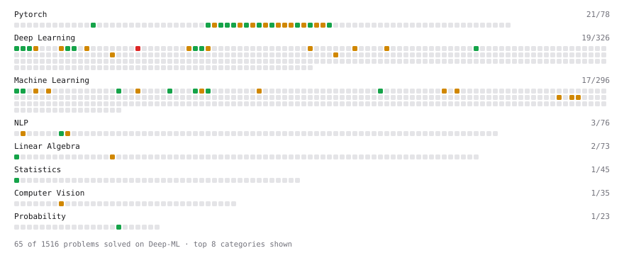

# Deep-ML

My machine learning practice from [Deep-ML](https://www.deep-ml.com). Every solution here was written by hand.

**59** solved · 54 problems · 5 labs · 0 math

[**Browse the interactive portfolio**](https://vishwajeet-hogale.github.io/deep-ml/) to replay this filling in over time.

## Problems

| | Difficulty | Solved | |
| --- | --- | --- | --- |
| [Calculate Covariance Matrix](https://www.deep-ml.com/problems/10) | easy | 2026-02-01 | [solution](problems/0010-calculate-covariance-matrix) |
| [Calculate Perplexity for Language Models](https://www.deep-ml.com/problems/320) | easy | 2026-02-03 | [solution](problems/0320-calculate-perplexity-for-language-models) |
| [Calculate R-squared for Regression Analysis](https://www.deep-ml.com/problems/69) | easy | 2026-02-03 | [solution](problems/0069-calculate-r-squared-for-regression-analysis) |
| [Compute Posterior Probability using Bayes' Theorem](https://www.deep-ml.com/problems/336) | easy | 2026-08-09 | [solution](problems/0336-compute-posterior-probability-using-bayes-theorem) |
| [Create and Inspect a Tensor](https://www.deep-ml.com/problems/1220) | easy | 2026-10-06 | [solution](problems/1220-create-and-inspect-a-tensor) |
| [Detect Overfitting or Underfitting](https://www.deep-ml.com/problems/86) | easy | 2026-08-09 | [solution](problems/0086-detect-overfitting-or-underfitting) |
| [Early Stopping Based on Validation Loss Plateau](https://www.deep-ml.com/problems/199) | easy | 2026-08-09 | [solution](problems/0199-early-stopping-based-on-validation-loss-plateau) |
| [Generate a Confusion Matrix for Binary Classification](https://www.deep-ml.com/problems/75) | easy | 2026-02-03 | [solution](problems/0075-generate-a-confusion-matrix-for-binary-classification) |
| [Gradient of a Square with Autograd](https://www.deep-ml.com/problems/1222) | easy | 2026-10-06 | [solution](problems/1222-gradient-of-a-square-with-autograd) |
| [Implement Dropout from Scratch](https://www.deep-ml.com/problems/901) | easy | 2026-08-10 | [solution](problems/0901-implement-dropout-from-scratch) |
| [Implement Global Average Pooling](https://www.deep-ml.com/problems/114) | easy | 2026-02-03 | [solution](problems/0114-implement-global-average-pooling) |
| [Implement ReLU Activation Function](https://www.deep-ml.com/problems/42) | easy | 2026-02-03 | [solution](problems/0042-implement-relu-activation-function) |
| [Implement ReLU and Leaky ReLU](https://www.deep-ml.com/problems/1226) | easy | 2026-10-06 | [solution](problems/1226-implement-relu-and-leaky-relu) |
| [Implement Ridge Regression Loss Function](https://www.deep-ml.com/problems/43) | easy | 2026-02-01 | [solution](problems/0043-implement-ridge-regression-loss-function) |
| [Leaky ReLU Activation Function](https://www.deep-ml.com/problems/44) | easy | 2026-07-12 | [solution](problems/0044-leaky-relu-activation-function) |
| [Linear Regression Using Gradient Descent](https://www.deep-ml.com/problems/15) | easy | 2026-01-31 | [solution](problems/0015-linear-regression-using-gradient-descent) |
| [Linear Regression Using Normal Equation](https://www.deep-ml.com/problems/14) | easy | 2025-04-17 | [solution](problems/0014-linear-regression-using-normal-equation) |
| [Matrix-Vector Dot Product](https://www.deep-ml.com/problems/1) | easy | 2025-04-17 | [solution](problems/0001-matrix-vector-dot-product) |
| [Mean Squared Error from Scratch](https://www.deep-ml.com/problems/1228) | easy | 2026-10-06 | [solution](problems/1228-mean-squared-error-from-scratch) |
| [Reshape and Transpose a Tensor](https://www.deep-ml.com/problems/1221) | easy | 2026-10-06 | [solution](problems/1221-reshape-and-transpose-a-tensor) |
| [Sigmoid Activation Function Understanding](https://www.deep-ml.com/problems/22) | easy | 2026-03-16 | [solution](problems/0022-sigmoid-activation-function-understanding) |
| [Single Linear Neuron Forward](https://www.deep-ml.com/problems/1224) | easy | 2026-10-06 | [solution](problems/1224-single-linear-neuron-forward) |
| [Single Neuron](https://www.deep-ml.com/problems/24) | easy | 2026-03-16 | [solution](problems/0024-single-neuron) |
| [Softmax Activation Function Implementation ](https://www.deep-ml.com/problems/23) | easy | 2026-03-16 | [solution](problems/0023-softmax-activation-function-implementation) |
| [BatchNorm1d Forward in Eval Mode](https://www.deep-ml.com/problems/1231) | medium | 2026-10-06 | [solution](problems/1231-batchnorm1d-forward-in-eval-mode) |
| [Binary Cross-Entropy from Logits](https://www.deep-ml.com/problems/1229) | medium | 2026-10-06 | [solution](problems/1229-binary-cross-entropy-from-logits) |
| [BLEU Score for Text Generation](https://www.deep-ml.com/problems/321) | medium | 2026-02-01 | [solution](problems/0321-bleu-score-for-text-generation) |
| [Build Scaled Dot-Product Attention](https://www.deep-ml.com/problems/490) | medium | 2026-08-09 | [solution](problems/0490-build-scaled-dot-product-attention) |
| [Calculate Correlation Matrix](https://www.deep-ml.com/problems/37) | medium | 2026-02-14 | [solution](problems/0037-calculate-correlation-matrix) |
| [Calculate Performance Metrics for a Classification Model](https://www.deep-ml.com/problems/77) | medium | 2026-02-03 | [solution](problems/0077-calculate-performance-metrics-for-a-classification-model) |
| [Dropout in Train vs Eval Mode](https://www.deep-ml.com/problems/1230) | medium | 2026-10-06 | [solution](problems/1230-dropout-in-train-vs-eval-mode) |
| [Dropout Layer](https://www.deep-ml.com/problems/151) | medium | 2026-07-13 | [solution](problems/0151-dropout-layer) |
| [Gradient of a Weighted Sum of Squares](https://www.deep-ml.com/problems/1223) | medium | 2026-10-06 | [solution](problems/1223-gradient-of-a-weighted-sum-of-squares) |
| [Implement Batch Normalization for BCHW Input](https://www.deep-ml.com/problems/115) | medium | 2026-01-31 | [solution](problems/0115-implement-batch-normalization-for-bchw-input) |
| [Implement Gradient Descent Variants with MSE Loss](https://www.deep-ml.com/problems/47) | medium | 2026-02-03 | [solution](problems/0047-implement-gradient-descent-variants-with-mse-loss) |
| [Implement Layer Normalization for Sequence Data](https://www.deep-ml.com/problems/109) | medium | 2026-02-04 | [solution](problems/0109-implement-layer-normalization-for-sequence-data) |
| [Implement Masked Self-Attention](https://www.deep-ml.com/problems/107) | medium | 2026-02-04 | [solution](problems/0107-implement-masked-self-attention) |
| [Implement Precision-Recall Curve](https://www.deep-ml.com/problems/278) | medium | 2026-08-09 | [solution](problems/0278-implement-precision-recall-curve) |
| [Implement ROC Curve Calculation](https://www.deep-ml.com/problems/276) | medium | 2026-08-09 | [solution](problems/0276-implement-roc-curve-calculation) |
| [Implement Self-Attention Mechanism](https://www.deep-ml.com/problems/53) | medium | 2026-02-02 | [solution](problems/0053-implement-self-attention-mechanism) |
| [Implement TF-IDF (Term Frequency-Inverse Document Frequency)](https://www.deep-ml.com/problems/60) | medium | 2026-02-01 | [solution](problems/0060-implement-tf-idf-term-frequency-inverse-document-frequency) |
| [Implement Variational Autoencoder (VAE) Loss (ELBO)](https://www.deep-ml.com/problems/393) | medium | 2026-02-17 | [solution](problems/0393-implement-variational-autoencoder-vae-loss-elbo) |
| [K-Means Clustering](https://www.deep-ml.com/problems/17) | medium | 2025-04-17 | [solution](problems/0017-k-means-clustering) |
| [Learning Curve Generator for Bias-Variance Diagnosis](https://www.deep-ml.com/problems/800) | medium | 2026-08-09 | [solution](problems/0800-learning-curve-generator-for-bias-variance-diagnosis) |
| [LoRA: Low-Rank Adaptation Forward Pass](https://www.deep-ml.com/problems/222) | medium | 2026-08-09 | [solution](problems/0222-lora-low-rank-adaptation-forward-pass) |
| [Mini-Batch Gradient Descent Step for Linear Regression](https://www.deep-ml.com/problems/803) | medium | 2026-08-09 | [solution](problems/0803-mini-batch-gradient-descent-step-for-linear-regression) |
| [Numerically Stable Softmax](https://www.deep-ml.com/problems/1227) | medium | 2026-10-06 | [solution](problems/1227-numerically-stable-softmax) |
| [Overlapping Max Pooling](https://www.deep-ml.com/problems/190) | medium | 2026-02-17 | [solution](problems/0190-overlapping-max-pooling) |
| [Principal Component Analysis (PCA) Implementation](https://www.deep-ml.com/problems/19) | medium | 2026-01-31 | [solution](problems/0019-principal-component-analysis-pca-implementation) |
| [Simple Convolutional 2D Layer](https://www.deep-ml.com/problems/41) | medium | 2026-02-01 | [solution](problems/0041-simple-convolutional-2d-layer) |
| [Single Neuron with Backpropagation](https://www.deep-ml.com/problems/25) | medium | 2026-03-16 | [solution](problems/0025-single-neuron-with-backpropagation) |
| [Stochastic Gradient Descent Step for Linear Regression](https://www.deep-ml.com/problems/802) | medium | 2026-08-09 | [solution](problems/0802-stochastic-gradient-descent-step-for-linear-regression) |
| [Two-Layer MLP Forward Pass](https://www.deep-ml.com/problems/1225) | medium | 2026-10-06 | [solution](problems/1225-two-layer-mlp-forward-pass) |
| [Implement Multi-Head Attention](https://www.deep-ml.com/problems/94) | hard | 2026-02-04 | [solution](problems/0094-implement-multi-head-attention) |

## Labs

| | Difficulty | Solved | |
| --- | --- | --- | --- |
| [Design Your Own Attention Mechanism](https://www.deep-ml.com/labs/10) | medium | 2026-02-20 | [solution](labs/0010-design-your-own-attention-mechanism) |
| [Fit Linear Regression with Autograd](https://www.deep-ml.com/labs/9ff596ea-672e-4101-9ce4-0856c55b62c9) | medium | 2026-10-06 | [solution](labs/9ff596ea-672e-4101-9ce4-0856c55b62c9-fit-linear-regression-with-autograd) |
| [MLP with Dropout and BatchNorm](https://www.deep-ml.com/labs/3480fd6b-ee7a-4afd-ba4b-5c934aeab10b) | medium | 2026-10-06 | [solution](labs/3480fd6b-ee7a-4afd-ba4b-5c934aeab10b-mlp-with-dropout-and-batchnorm) |
| [PyTorch: Implement Your Own Gradient Descent Training Step](https://www.deep-ml.com/labs/12) | medium | 2026-02-19 | [solution](labs/0012-pytorch-implement-your-own-gradient-descent-training-step) |
| [Train a Tiny CNN Image Classifier](https://www.deep-ml.com/labs/91c76ab2-7d3a-43a7-98ce-385aab6f1691) | hard | 2026-10-07 | [solution](labs/91c76ab2-7d3a-43a7-98ce-385aab6f1691-train-a-tiny-cnn-image-classifier) |

---

_This file is regenerated by Deep-ML on every push._
